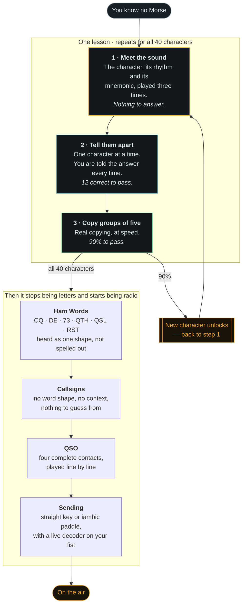
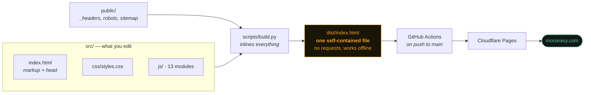

# Morse Easy

**Learn CW by ear, free, in your browser.** No account, no install, no tracking.

**[morseasy.com](https://morseasy.com)**

Built by **Vander Nunes — N5EDB**, while learning CW myself. I got my General
ticket in January 2026 and had already worked simplex, repeaters, SSB, FT8,
Winlink, satellites and fox hunts. CW was the one thing left, and every tool I
tried either tested me on sounds it had never taught me, or handed me a decoder
that read the code *for* me. Neither one teaches you anything. So I wrote this.

---

## The problem this solves

Most Morse apps drop you straight into a test:

> Here are five characters. Type what you heard.

If nobody ever told you what **K** sounds like, you are not learning — you are
guessing. And a hardware decoder is worse: it trains your eyes while your ears
stay exactly as untrained as they were on day one.

**Morse Easy never tests you on a sound it has not taught you first.**

## How you learn here

Every lesson runs in three steps, and you cannot skip ahead.



### The two rules the whole app is built around

1. **Never count dots.** Characters are always sent at 18–25 wpm so you learn
   each one as a single sound. The extra silence *between* characters is what
   makes it slow enough to follow. That is the Farnsworth method, and it is why
   the speed control has two separate numbers.
2. **Never guess.** If a sound will not come back to you, tap it in
   **Hear any character** — it sits under the practice box on every lesson.
   Looking it up teaches you something. Guessing teaches you nothing.

## What is in it

| Tab | What it does |
|---|---|
| **Learn** | Koch lessons, 40 characters, two new ones at a time, in the three steps above |
| **Letters** | The whole character set with patterns and mnemonics — tap any cell to hear it |
| **Words** | Q-codes, abbreviations, prosigns, numbers and plain English as whole-word sounds |
| **Callsigns** | Real US formats (1×2, 2×1, 1×3, 2×2, 2×3) plus DX prefixes, sent twice like a real caller |
| **QSO** | Four complete contacts: answering a CQ, calling CQ, a POTA/contest exchange, and one where everything goes wrong |
| **Sending** | Straight key or iambic keyer — keyboard, touch pads, with a live decoder and a dah:dit ratio meter |
| **Reference** | Prosigns, 20 Q-codes, ~60 abbreviations, RST tables, your first contact word for word, and where to find slow CW on the air |

Put your own callsign in under the gear and it flows through the QSO scripts,
the callsign drill and the reference sheet.

## Use it

Just open **[morseasy.com](https://morseasy.com)**. It works on a phone, a
tablet, or a desktop, and once loaded it works with no connection at all.

Your progress is saved in your browser. Nothing is sent anywhere — there is no
server to send it to.

### Run it locally

```bash
git clone https://github.com/vandernunes/morseasy.git
cd morseasy
python3 scripts/build.py
python3 -m http.server 8000 --directory dist
# open http://localhost:8000
```

No npm, no bundler, no dependencies. Python 3.8+ and a browser.

## How it is built



**Why one file?** It has to work from a phone with no signal, from a USB stick
at a club meeting, and from a `file://` URL. The source is split into readable
modules; the build inlines them. You get both.

```
morseasy/
├── src/
│   ├── index.html          markup, head, script order
│   ├── css/styles.css      the whole visual system
│   └── js/                 13 modules, loaded in order (see docs/ARCHITECTURE.md)
├── public/                 copied verbatim into dist/
├── scripts/
│   ├── build.py            src/ + public/ → dist/
│   └── check.py            16 checks; run before every push
├── docs/
│   ├── ARCHITECTURE.md     module map, load order, the rules that bite
│   └── LEARNING-PATH.md    the teaching method and why it is shaped this way
└── dist/                   built output, not committed
```

Full detail in **[docs/ARCHITECTURE.md](docs/ARCHITECTURE.md)**.

## Contributing

Yes please — especially from operators who actually work CW. Corrections to the
on-air content matter as much as code. Read
**[CONTRIBUTING.md](CONTRIBUTING.md)** for the commit convention, branch naming
and how to run the checks.

Good first issues: more QSO scenarios, more mnemonics, translations, additional
DX prefixes, accessibility fixes.

## Where to go once the characters are in your ear

- **[CW Academy](https://cwops.org/cw-academy/)** (CWops) — free, semester-based
  classes with a live advisor. The single most effective thing on this list.
- **[Long Island CW Club](https://longislandcwclub.org/)** — daily Zoom classes,
  small annual fee, very beginner-friendly.
- **[SKCC](https://www.skccgroup.com/)** and **[FISTS](https://fists.org/)** —
  sked pages where you can arrange a slow, forgiving first contact with someone
  who expects a beginner.
- **K1USN SST** — a one-hour slow-speed sprint, 20 wpm max, Fridays and Sundays.
  The friendliest first contest that exists.

## Author

**Vander Nunes — N5EDB**
General class · IC-7300 MK2 · ID-52A · [github.com/vandernunes](https://github.com/vandernunes)

If this helped you get on the air, I would genuinely like to know. Open an issue
and tell me about your first CW contact.

## License

[MIT](LICENSE) — do what you like with it, just keep the copyright notice.

73 es GL de N5EDB
