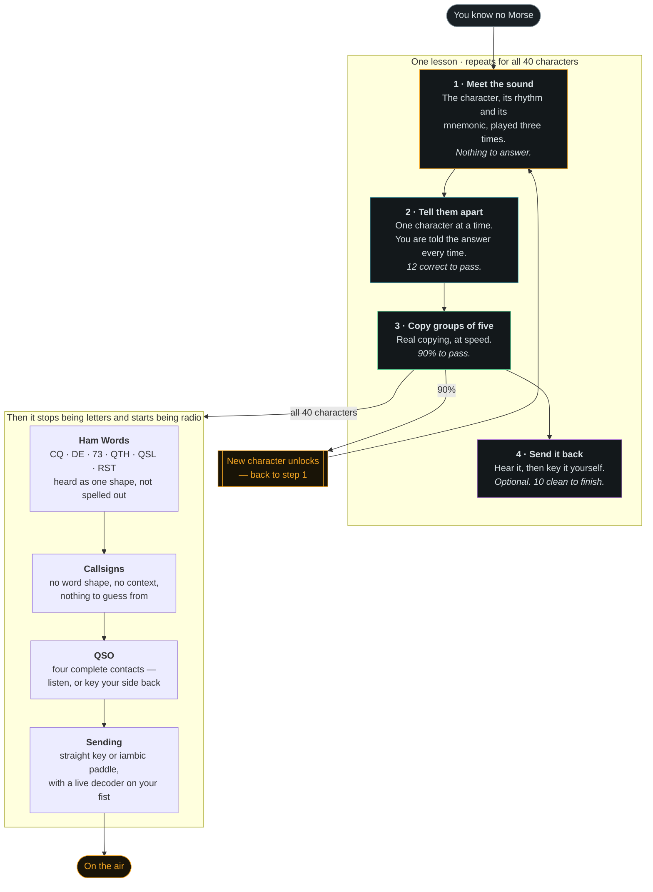
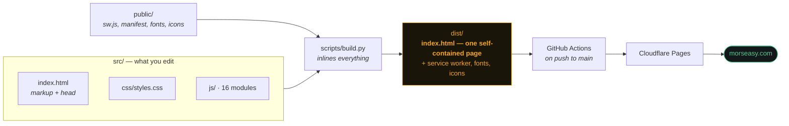

# Morse Easy

**Learn CW by ear, free, in your browser.** No account, no tracking, works offline.

**[morseasy.com](https://morseasy.com)**

Built by **Vander Nunes — N5EDB**, while learning CW myself. I got my General
ticket in January 2026 and had already worked simplex, repeaters, SSB, FT8,
Winlink, satellites and fox hunts. CW was the one thing left, and every tool I
tried either tested me on sounds it had never taught me, or handed me a decoder
that read the code *for* me. Neither one teaches you anything. So I wrote this.

---

## The problem this solves

Most Morse apps drop you straight into a test:

> Here are five characters. Type what you heard.

If nobody ever told you what **K** sounds like, you are not learning — you are
guessing. And a hardware decoder is worse: it trains your eyes while your ears
stay exactly as untrained as they were on day one.

**Morse Easy never tests you on a sound it has not taught you first.**

## How you learn here

Every lesson runs in three steps, and you cannot skip ahead.



### You never have to guess what to do next

The **Home** tab opens on one button that goes exactly where you left off —
lesson, step and all. Under it is the whole path, five stages, each saying when
it starts making sense rather than when it is allowed:

1. **Learn the alphabet** — the long one; everything else builds on it
2. **Hear whole words** — easier once you know about 10 characters
3. **Copy callsigns** — easier once you know about 20
4. **Work a contact** — easier once you know about 26
5. **Send it yourself** — open from day one; sending is easier than copying

**Nothing is locked.** Every stage stays clickable. Telling someone what usually
works is not the same as deciding for them.

### The two rules the whole app is built around

1. **Never count dots.** Characters are always sent at 18–25 wpm so you learn
   each one as a single sound. The extra silence *between* characters is what
   makes it slow enough to follow. That is the Farnsworth method, and it is why
   the speed control has two separate numbers.
2. **Never guess.** If a sound will not come back to you, tap it in
   **Hear any character** — it sits under the practice box on every lesson.
   Looking it up teaches you something. Guessing teaches you nothing.

## What is in it

| Tab | What it does |
|---|---|
| **Home** | What to do next, in one button. Your progress, your streak, and the whole path laid out |
| **Learn** | Koch lessons, 40 characters, two new ones at a time, in the four steps above |
| **Words** | Q-codes, abbreviations, prosigns, numbers and plain English as whole-word sounds. Rounds of ten, scored, with a best to beat |
| **Callsigns** | Real US formats (1×2, 2×1, 1×3, 2×2, 2×3) plus DX prefixes, sent twice like a real caller. Rounds of ten |
| **QSO** | Four complete contacts. **Listen** and copy, or **Work it** — their side plays and you key your replies back, turn by turn, until 73 |
| **Sending** | Straight key or iambic keyer — tap the screen, short press for a dit and long for a dah, with a live decoder and a dah:dit ratio meter |
| **Reference** | The character set with patterns and mnemonics (tap to hear), prosigns, 20 Q-codes, ~60 abbreviations, RST tables, your first contact word for word, and where to find slow CW |

Put your own callsign in under the gear and it flows through the QSO scripts,
the callsign drill and the reference sheet.

## Use it

Just open **[morseasy.com](https://morseasy.com)**.

### Install it, and it works with no signal

Open **Settings (the gear) → Use it offline**, or use your browser's install
button. On an iPhone: **Share → Add to Home Screen**.

Once installed there is nothing left to fetch. The page, the fonts and the
icons are the whole app, and there is no API, no analytics and no backend —
so it runs identically on a plane, in a basement, or in a field with no bars.

**Installing also stops iOS deleting your progress.** Safari clears
script-writable storage after seven days without a visit, so a fortnight away
costs you every lesson and your streak. Installed apps are exempt.

### Moving to another device

There is no account, so nothing syncs by itself. **Settings → Move to another
device** gives you two ways to carry your progress across:

- **Copy transfer link** — send it to yourself however you like (message, email,
  AirDrop) and open it on the other device
- **Save a backup file** — a small JSON file that restores everything

The link keeps everything after the `#`. Browsers never send a URL fragment to
a server, so even travelling as a link your practice history reaches nobody.

An imported code is treated as untrusted: every key is whitelisted, every number
clamped, every string filtered. Verified against a payload containing script
tags, absurd numbers, junk keys and a prototype-pollution attempt.

### Your data

Progress is saved in your browser and never leaves the device. There is no
server to send it to, no account, and no tracking. The page makes **zero**
third-party requests — the fonts are served from this origin, which is why the
Content-Security-Policy names no external host at all.

### Run it locally

```bash
git clone https://github.com/vandernunes/morseasy.git
cd morseasy
python3 scripts/build.py
python3 -m http.server 8000 --directory dist
# open http://localhost:8000
```

No npm, no bundler, no dependencies. Python 3.8+ and a browser.

## How it is built



**Why one file?** The page has to work from a phone with no signal, from a USB
stick at a club meeting, and from a `file://` URL. The source is split into
readable modules; the build inlines all of them into a single `index.html`. You
get both. Fonts, icons and the service worker sit alongside it so the installed
app is fully self-contained.

```
morseasy/
├── src/
│   ├── index.html          markup, head, script order
│   ├── css/styles.css      the whole visual system
│   └── js/                 16 modules, loaded in order (see docs/ARCHITECTURE.md)
├── public/                 copied verbatim into dist/
│   ├── sw.js               service worker — precache and offline
│   ├── manifest.webmanifest
│   └── fonts/ icons/       self-hosted, so there are no third-party requests
├── scripts/
│   ├── build.py            src/ + public/ → dist/
│   └── check.py            63 checks; run before every push
├── docs/
│   ├── ARCHITECTURE.md     module map, load order, the rules that bite
│   └── LEARNING-PATH.md    the teaching method and why it is shaped this way
└── dist/                   built output, not committed
```

Full detail in **[docs/ARCHITECTURE.md](docs/ARCHITECTURE.md)**.

## Contributing

Yes please — especially from operators who actually work CW. Corrections to the
on-air content matter as much as code. Read
**[CONTRIBUTING.md](CONTRIBUTING.md)** for the commit convention, branch naming
and how to run the checks.

Good first issues: more QSO scenarios, more mnemonics, translations, additional
DX prefixes, accessibility fixes.

## Where to go once the characters are in your ear

- **[CW Academy](https://cwops.org/cw-academy/)** (CWops) — free, semester-based
  classes with a live advisor. The single most effective thing on this list.
- **[Long Island CW Club](https://longislandcwclub.org/)** — daily Zoom classes,
  small annual fee, very beginner-friendly.
- **[SKCC](https://www.skccgroup.com/)** and **[FISTS](https://fists.org/)** —
  sked pages where you can arrange a slow, forgiving first contact with someone
  who expects a beginner.
- **K1USN SST** — a one-hour slow-speed sprint, 20 wpm max, Fridays and Sundays.
  The friendliest first contest that exists.

## Author

**Vander Nunes — N5EDB**
General class · IC-7300 MK2 · ID-52A · [github.com/vandernunes](https://github.com/vandernunes)

If this helped you get on the air, I would genuinely like to know. Open an issue
and tell me about your first CW contact.

## License

[MIT](LICENSE) — do what you like with it, just keep the copyright notice.

73 es GL de N5EDB
