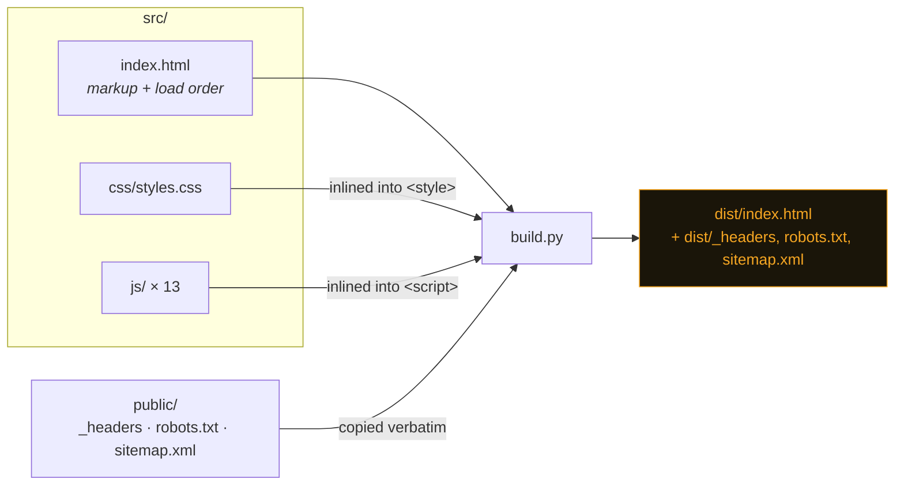
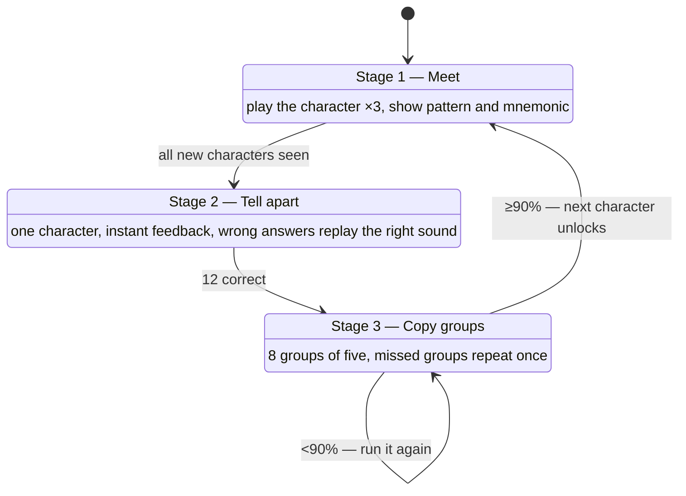

# Architecture

Morse Easy is a static page with no backend, no framework and no dependencies.
This document is for anyone about to change the code.

## The one constraint everything follows

**The deployed app must be a single HTML file that works with the network off.**

It has to run from a phone with no signal, from a USB stick at a club meeting,
and from a `file://` URL. That rules out a bundler, a module graph resolved at
runtime, and any CDN script.

It does *not* rule out readable source. `src/` is split into modules and
`scripts/build.py` inlines them:



`build.py` does textual inlining and refuses any file containing a literal
`</script` or `</style`, which would close the tag early.

## Modules and load order

`src/js/*.js` are **classic scripts**, not ES modules. They share one global
scope and run in the order `src/index.html` lists them. There is no import
graph — order *is* the dependency graph.

| # | File | Responsibility | Needs |
|---|---|---|---|
| 1 | `morse.js` | Morse table, reverse table, Koch order, mnemonics | — |
| 2 | `content.js` | Q-codes, abbreviations, prosigns, word sets, RST tables, QSO scripts, callsign generators | — |
| 3 | `audio.js` | Sidetone oscillator, Farnsworth timing, `play()`, keying lamp | `morse` |
| 4 | `state.js` | Settings, progress, `localStorage`, optional sync, day streak | — |
| 5 | `ui.js` | `esc`, `diffMarkup`, `paintEntry`, `buildKeypad`, `sub()` | `state` |
| 6 | `settings.js` | Speed presets, the settings dialog, the help dialog | `state`, `audio` |
| 7 | `learn.js` | Koch lessons — the three-step flow | 1–6 |
| 8 | `letters.js` | Tap-to-hear character charts | `morse`, `audio` |
| 9 | `drills.js` | `makeDrill()` plus the Words and Callsigns instances | 1–6 |
| 10 | `qso.js` | Simulated contacts, played line by line | `content`, `audio`, `ui` |
| 11 | `send.js` | Straight key and iambic keyer, live decoder, fist meters | `morse`, `audio` |
| 12 | `reference.js` | Reference tables, first-contact script | `content`, `ui` |
| 13 | `app.js` | Mode switching, global keys, boot. **Must be last.** | everything |

### Rules that will bite you

1. **Top-level names must be unique across every file.** Two files declaring
   `const P` throws at load. `scripts/check.py` fails the build on this.
2. **`app.js` stays last.** It calls `renderAll()` and boots the page.
3. **Adding a file means editing `src/index.html`.** `check.py` fails if a file
   in `src/js/` is never loaded, or a loaded file does not exist.
4. **`[hidden]{display:none!important}` must stay in the CSS.** Panes and steps
   are toggled with the `hidden` attribute, but `.pane` and `.stack` set
   `display:flex`, which beats the browser default for `[hidden]`. Remove the
   override and every tab renders at once. `check.py` guards it.

## Audio

One oscillator runs for the life of the page. A gain node gates it — that is
what produces a dit or a dah. Creating an oscillator per element clicks and
drifts; gating one does not.

Every edge uses a 5 ms exponential ramp. Square edges produce key clicks, which
are the first thing an experienced operator notices about a bad signal.

Timing is the **ARRL Farnsworth** formula, so two speeds are independent:

```
dit          = 1.2 / charWpm                    seconds
ta           = (60·c − 37.2·s) / (s·c)          total delay to distribute
inter-char   = 3·ta / 19
inter-word   = 7·ta / 19
```

Characters are always sent at `charWpm`. Only the silence between them stretches.
This is the whole reason the app can teach sound-recognition instead of counting.

Playback is scheduled ahead on the Web Audio clock, not with `setTimeout` — the
timer thread is not accurate enough for code that has to sound right. `setTimeout`
is used only for UI callbacks that follow the audio.

**iOS and Safari** will not start an AudioContext without a user gesture. A
one-shot listener on the first `pointerdown` or `keydown` resumes it.

## State

```
localStorage["morseasy-v1"]        progress: lesson, stage, per-character
                                   hit/miss counts, best scores, day streak,
                                   callsign / name / QTH / rig
localStorage["morseasy-v1-cwpm"]   character speed
localStorage["morseasy-v1-ewpm"]   overall speed
localStorage["morseasy-v1-tone"]   sidetone pitch
localStorage["morseasy-v1-vol"]    volume
```

Nothing leaves the browser. There is no server to send it to, and there will not
be one. Bumping the schema means bumping the `v1` suffix so old data is ignored
rather than misread.

Every read and write is wrapped in `try`/`catch`. Private windows, cleared site
data and browsers configured to block storage all throw on access, and the page
has to render correctly with no saved value at all.

## Lesson flow

`learn.js` is a small state machine over three stages. `P.stageByLesson[n]`
records the furthest stage reached for lesson `n`, so the stepper can send you
back but not forward past what you have earned.



Scoring detail worth knowing: in stage 3 a repeated group does **not** score
twice. Only the first attempt counts, so the repeat is teaching, not padding.

## Styling

A single dark theme, committed on purpose — it is an instrument panel, and CW
gets operated at night. Everything derives from custom properties on `:root`:
grounds, rules, ink, the amber accent, and the semantic good/miss pair. Use the
tokens; do not hard-code a colour that already has one.

## Offline

`public/sw.js` precaches the page, the eight font files and the icons, then
serves cache-first. A navigation always resolves to the cached shell, which is
what lets someone open the installed app with no connection.

The cache name carries a build id that `build.py` derives from a hash of the
built page plus every precached file. Any change produces a new cache; the old
one is deleted on activate. A waiting worker is **not** activated automatically
— the page offers a reload instead, because swapping the app out from under
someone mid-lesson loses their group.

`check.py` verifies that every path in the worker's `SHELL` array actually
exists in `dist/`. If one does not, `addAll()` rejects, the install fails, and
every returning visitor silently stays on the previous build.

Fonts are self-hosted for three reasons: the page then makes no third-party
requests at all, the installed app renders correctly offline on first launch,
and the CSP can name no external origin.

## Deploy

`main` → GitHub Actions → `build.py` → `check.py` → `wrangler pages deploy` →
Cloudflare Pages → morseasy.com. About a minute end to end. Pull requests get a
preview build and checks, but do not deploy.
