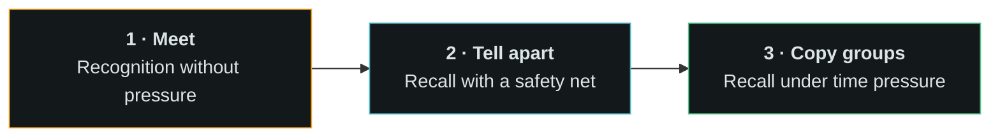

# The learning path, and why it is shaped this way

This is the reasoning behind the teaching design. If you are proposing a change
to how lessons work, start here.

## The failure this project was built to fix

The first version of this app did what almost every Morse trainer does: it
opened on lesson 1 with K and M, played five characters, and asked you to type
what you heard.

The person it was built for looked at it and said:

> I have no idea what to do. Should I put MKKKK? The problem is I guessed. I
> have no idea what it sounds to be K or M, so I'm not sure how to start
> learning without guessing, and that is not learning.

That is the whole problem with Morse training software, stated perfectly. The
app had a **test** where it needed a **lesson**. Everything below exists because
of that sentence.

## Two rules that override everything

### 1. Never test a sound the app has not taught first

Before a character can appear in any drill, the learner must have met it: seen
it, heard it several times, and been told what it was, with nothing to answer.

### 2. Never make guessing the fastest path forward

If guessing gets you through faster than knowing, people will guess, and they
will learn nothing. So:

- A wrong answer in stage 2 costs nothing but **replays the correct sound**. The
  miss ends with you hearing the right thing.
- **Hear any character** sits under the practice box on every lesson. Looking a
  sound up is always available and always cheaper than a wrong guess.
- Stage 2 counts **correct answers**, not attempts. Guessing does not advance
  you; it just costs time.

## The three stages

**Stage 1 — Meet.** The character, huge. Its pattern as `— · —`. Its rhythm as
`dah-di-dah`. A mnemonic — *KANG-a-ROO*. Played three times. No input accepted.
You leave when you say you are ready, not when you score something.

**Stage 2 — Tell apart.** One character at a time, from the lesson's set. You
name it, and you are told immediately — right or wrong, with the rhythm spoken
back. Wrong answers replay the correct sound before moving on. Twelve correct
and you are through. One character at a time means a miss is recoverable; five
at a time means one miss cascades.

**Stage 3 — Copy groups.** Five characters, at speed, no hand-holding. This is
real copying. 90% unlocks the next character. Missed groups repeat once, scored
on the first attempt only.

**Stage 4 — Send it back.** You hear a character and key it yourself. Copying
trains your ears; this trains your hand, on the same characters, while they are
still fresh. Ten clean finishes the step.

It is **optional on purpose**. The next lesson already unlocked at stage 3,
because not everyone has the dexterity on day one and nobody should be stopped
from learning new sounds by a touchscreen. The stepper marks it done when you
finish it, so it is visible without being a gate.

Keying speed is a separate setting from listening speed. Everyone copies faster
than they can send, and at 20 wpm a dit has to be released inside 120 ms, which
is not a reasonable first target with a thumb.

Why three and not two? Recognition, cued recall and free recall are different
skills. Jumping from "I have never heard this" to "copy five in a row" skips the
middle one, and the middle one is where the sound actually becomes automatic.

## Why Koch, and why Farnsworth

**Koch:** start with two characters at full speed and add one at a time when you
hit 90%. The alternative — learn all 40 slowly, then speed up — teaches you to
count dots, and counting is a habit that takes months to break.

**Farnsworth:** send each character at 18–25 wpm and stretch the silence between
them. The character's *shape* stays the shape you will hear on the air at 20
wpm. Only your thinking time changes. This is why the speed control has two
numbers and why the app nags you to raise **Overall**, never **Character**.

The order `K M R S U A P T L O W I . N J E F 0 Y ,` is the standard Koch
sequence — it front-loads characters that are maximally distinct from each other.

## After the alphabet

Forty characters is not the ability to have a conversation. The remaining tabs
exist because each one trains something the alphabet drill cannot:

| Tab | The skill it builds |
|---|---|
| **Words** | Whole-word recognition. Experienced operators do not hear `C-Q` — they hear *CQ*, one shape. |
| **Callsigns** | Copying with no context. No word shape, no grammar, nothing to predict from. This is the hardest thing in CW and the reason people freeze in pileups. |
| **QSO** | Structure. Knowing what comes next means you only have to copy the part that varies. In **Work it** mode you key your own side, so copying and sending happen in the same contact, under the same pressure. |
| **Sending** | Timing awareness. The live decoder is honest: if it cannot read you, neither can the other operator. |

The **QSO** tab deliberately includes a scenario where everything goes wrong —
missed callsigns, fading, interference, someone sending too fast. `AGN?`,
`QRS PSE` and `QRM HR` are what actually keep a beginner's contact alive, and
most training material never mentions them.

## Working a contact, not just hearing one

The QSO tab has two modes. **Listen** plays every line for you to copy.
**Work it** plays their side and makes you key yours.

Three decisions in that mode are worth explaining.

**Their over ending starts your turn, with no button.** On the air nobody
prompts you; the silence is the prompt. Pressing "next" to continue would teach
the wrong reflex.

**You key a required subset, not the whole line.** The scripts are verbose
because real operators pad, but demanding 120 flawless characters from a
beginner punishes without teaching. Each of your turns carries a `send` field:
the part the contact would genuinely fail without — the callsigns, the report,
the name, the QTH, the 73. Spacing is not judged; characters are.

**Eight dits clears the line.** That is `HH`, the real on-air "I made an error,
here it comes again". Every app would give you a backspace. Learning the prosign
instead is a skill you keep, and it is already in the Reference tab. There is a
button too, for people who have not learned it yet.

## Things deliberately left out

- **No decoder.** A hardware or software decoder trains your eyes while your
  ears stay untrained, and it falls apart on exactly the signals you need to
  copy — hand-sent, fading, with interference. The Sending tab decodes *your*
  fist, which is a different thing: checking your own output, not reading
  someone else's.
- **No dots and dashes as a memory aid.** Patterns are shown in Meet and in the
  Letters chart as a reference, never during a drill. Writing down `-.-` and
  decoding it later is the habit this method exists to prevent.
- **No streaks that punish.** The day counter is there because daily practice is
  the single biggest predictor of success. It never scolds you for missing a day.
- **No leaderboards, no accounts.** The only person your copy speed matters to
  is you.

## If you are proposing a change

Ask: **does this make guessing a viable strategy?** If yes, it is wrong, even if
it is more fun. Everything else is negotiable.
